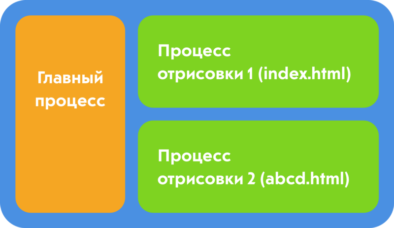

_Перевод «[How to Easily Build Desktop Apps with HTML, CSS and JS](https://medium.com/p/d3e3f03f95a5)» Адитьи Шридхары._

<figure>
    
    <figcaption>
        Фотография <a href="https://unsplash.com/@robinpierre">Робина Пьерра</a>
    </figcaption>
</figure>

Можно ли использовать HTML, CSS и JavaScript для создания десктопных приложений?

Ответ — да :)

В этой статье мы сосредоточимся в основном на том, как Electron можно использовать для создания десктопных приложений с использованием веб-технологий.

## Electron

[Electron](https://electronjs.org/) может быть использован для создания десктопных приложений, также эти приложения будут мультиплатформенными — Windows, Mac, Linux и другие.

Electron объединяет Chromium и Node.js в одну среду исполнения. Это позволяет нам запускать код HTML, CSS и JavaScript в виде десктопного приложения.

## Electron Forge

Если Electron используется напрямую, то перед сборкой приложения потребуется определённая ручная настройка. Также, если вы хотите использовать Angular, React, Vue или любой другой фреймворк или библиотеку, вам нужна будет ручная настройка.

[Electron Forge](https://electronforge.io/) значительно упрощает все вышеперечисленное.

Он предоставляет шаблонные приложения с Angular, React, Vue и другими фреймворками, что позволяет избежать дополнительных танцев с бубном.

Также он обеспечивает простоту сборки и упаковки приложения. В нём есть множество других функций, которые можно найти в [документации](https://docs.electronforge.io/).

## Предварительная подготовка

Убедитесь, что у вас установлен Node.js. Если нет, то его можно скачать [отсюда](https://nodejs.org/en/). Установите Electron Forge глобально, используя следующую команду:

```no-highlight
npm install -g electron-forge
```
## Начнём с приложения

Используйте следующую команду для создания вашего приложения:

```no-highlight
electron-forge init simple-desktop-app-electronjs
```

simple-desktop-app-electronicjs — это название приложения.

Потребуется некоторое время, чтобы команда, указанная выше, отработала. После завершения предыдущего процесса запустите приложение с помощью следующих команд:

```no-highlight
cd simple-desktop-app-electronjs
npm i
npm start
```
Это должно открыть окно как на скрине ниже:


## Разберёмся в структуре и коде

Приложение имеет определенную структуру папок. Здесь я перечислю некоторые важные моменты в этой структуре папок.

#### package.json

Содержит информацию о приложении, которое вы создаете, все зависимости, необходимые для приложения, и несколько скриптов. Некоторые из скриптов уже предварительно настроены, но вы также можете добавлять новые.

Путь `config.forge` содержит все конфигурации конкретно для Electron. Например, `make-target` используется для указания целевых файлов для различных платформ, таких как Windows, Mac или Linux.

#### src/index.js

Согласно `package.json`, `index.js` является основным скриптом. Процесс, который запускает основной скрипт, называется главным процессом. Таким образом, основной процесс запускает скрипт `index.js`.

Основной процесс нужен для отображения элементов интерфейса. Это делается путем создания страниц. Каждая созданная страница выполняется в процессе, называемом **процессом отрисовки**.

## Главный процесс и процесс отрисовки

Основное предназначение главного процесса — создание страниц с помощью экземпляра BrowserWindow. Экземпляр BrowserWindow использует процесс отрисовки для запуска каждой страницы.

**Любое приложение может иметь только один главный процесс, но много процессов визуализации.**

Также возможно взаимодействие между главным процессом и процессом отрисовки. Однако, я не буду останавливаться на этом в текущей статье.



_Архитектура Electron, показывающая главный процесс и процессы отрисовки. Названия файлов могут быть другими._

**abcd.html** показан в качестве второй веб-страницы в приведенной выше архитектуре. Но в нашем коде у нас не будет второй веб-страницы.

#### src/index.js

index.js загружает файл index.html в новый экземпляр `BrowserWindow`.

Это означает, что `index.js` создает новое окно GUI и загружает его со страницей `index.html`. Страница `index.html` запускается в своем собственном процессе отрисовки.

#### Код в index.js с пояснениями

Большая часть кода, созданного в `index.js`, содержит хорошие комментарии, объясняющие, что происходит. Здесь я упомяну несколько ключевых моментов, которые следует отметить в `index.js`:

```no-highlight
mainWindow = new BrowserWindow({
    width: 800,
    height: 600,
});

// и загрузи index.html из app.
mainWindow.loadURL(`file://${__dirname}/index.html`);
```

Приведенный выше фрагмент кода просто создает экземпляр `BrowserWindow` и загружает `index.html` в `BrowserWindow`. Вы увидите, что `app` часто используется в коде. Например, возьмите приведенный ниже фрагмент:

```no-highlight
app.on('ready', createWindow);
```

`app` используется для управления жизненным циклом событий приложения. Приведенный выше фрагмент кода говорит, что, когда приложение будет готово, нужно загрузить первое окно.

Точно так же `app` может использоваться для выполнения других действий с различными событиями. Например, его можно использовать для выполнения некоторых действий непосредственно перед закрытием приложения и так далее.
